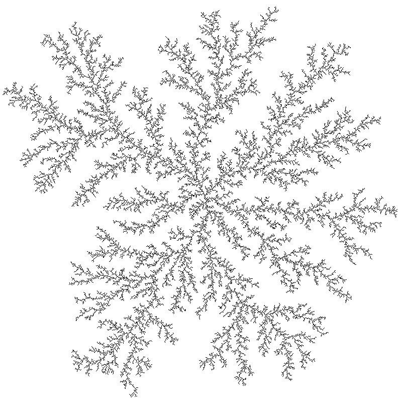
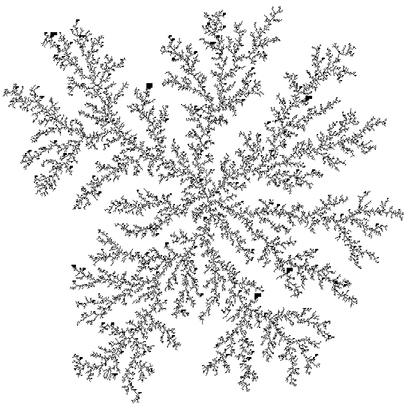

# Lab 4

## Getting started

```bash
make IMAGE_NAME="balloons"
```

This command will create a `QuadTree` based on the [image](images/balloons.pgm), save the [representation](images/balloons.pgm.qd) of the tree to disk and recreate the [image](images/balloons2.pgm.qd) using the compressed file.

We can use the compression ratio to the evaluate implementation.

```
Compression ratio = Image size (bytes) / Compressed image size (bytes)
```

## Examples

#### Apollonian gasket

Original


Recovered


```
Compression ratio = 1439769 / 880104 = 1.64
```

#### Balloons

Original


Recovered


```
Compression ratio = 1209029 / 6855478 = 0.18
```

#### DLA

Original



Recovered



```
Compression ratio = 2472811 / 3053678 = 0.81
```
